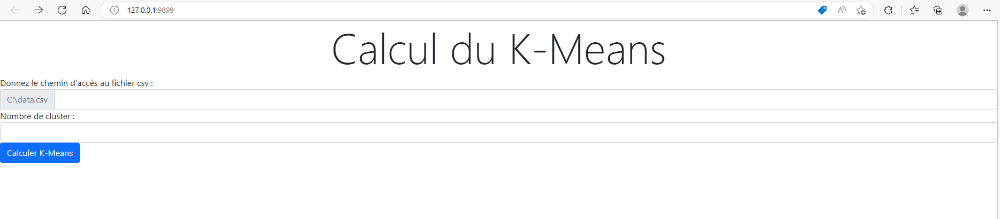
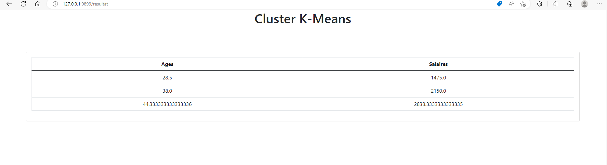

# InteroperabiliteElaticiteTP1

## <ins>Context</ins>

Vous trouverez ici les applications réalisées pour le cours d'intéropérabilité et élasticité des systèmes d'informations.   Il nous est demandé de faire un backend en _java et son jdk 8_ qui expose un service de calcul K-Means une partie du code a été fourni par le professeur pour ce qui concerne l'exposition du services WSDL. Nous avons construit un client en _python_ avec la librairie _flask_ pour monter rapidement un site web ainsi que la librairie _zeep_ pour la gestion de l'appel au service. Le dernier client sera réalisé en _Java et son jdk 11_ avec le framework _Springboot_ et le templateur _Thymeleaf_ pour refaire la même présentation que le client fait en python.

## <ins>Description : </ins>

- le dossier _SoapTP_ contient le fournisseur de service wsdl.
- Le dossier _client2tp1_ contient le client java qui consume le client wsdl.
- Le dossier _pythonProject_ est le client python qui consume le client wsdl.
- Le dossier _image_ contient les images pour le fichier _readme.md_.

## <ins>Présentation du client</ins>

Voici a quoi resemble le formulaire pour réaliser le calcule du K-means : 

Voici la vue de résultat du calcul : 

